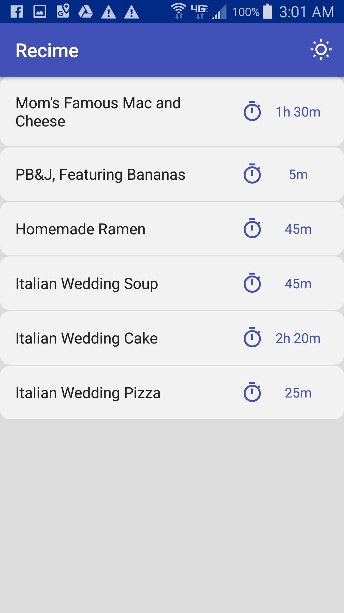
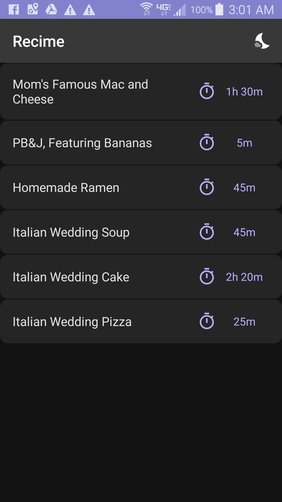

# Recime
A simple Android app designed to create and store recipes. It is written in Kotlin and currently in progress.

## The Landing Page

 

## Architecture
This app takes an approach similiar to the Model-View-Viewmodel architectural pattern to facilitate seperation of concerns. The main components are the **UI**, the **Viewmodel**, and the **database abstraction layer**.

#### UI
The UI is is used for displaying views and capturing input. Data binding is used so that each xml layout has immediate access to the data it needs to display. The UI also observes changes in the the data to be displayed, via [LiveData](https://developer.android.com/topic/libraries/architecture/livedata), and updates accordingly.

#### Viewmodel
The Viewmodel is used for holding/trasforming the data the UI needs to display and handling the input that the UI caputres.

#### Database Abstraction Layer
The database abstraction layer, implemented with the [Room Persistence Library](https://developer.android.com/topic/libraries/architecture/room), stores all of the recipe information, and provides idiomatic database access via Data Access Objects (DAOs).

#### Bringing It All Together
The following example demonstrates how these entities work together: the recipe Viewmodel uses the recipe DAO to get a LiveData list of recipes from the database, which the UI observes; upon observing a change to the list of recipes, the UI updates the views to include the changes.

## Database Tables
Recime's database consists of three tables: recipes, ingredients, and instructions.

### Recipes:
|id: Long|name: String|timeEstimateInMinutes: Int|notes: String|
|:---:|:---:|:---:|:---:|
|...|...|...|...|

###### Primary Key = id

### Ingredients:
|recipeId: Long|description: String|quantity: Int|unitOfMeasurement: String|
|:---:|:---:|:---:|:---:|
|...|...|...|...|

###### Primary Key = recipeId, description
###### Foreign Key = recipeId --> id

### Instructions:
|recipeId: Long|description: String|orderOfInstruction: Int|
|:---:|:---:|:---:|
|...|...|...|

###### Primary Key = recipeId, orderOfInstruction
###### Foreign Key = recipeId --> id

## TODO
* Display ingredients, instructions, time, and notes
* User edit/creation

## References
My app architecture and room database implementation were inspired by Udacity's [Developing Android Apps with Kotlin course](https://www.udacity.com/course/developing-android-apps-with-kotlin--ud9012).
